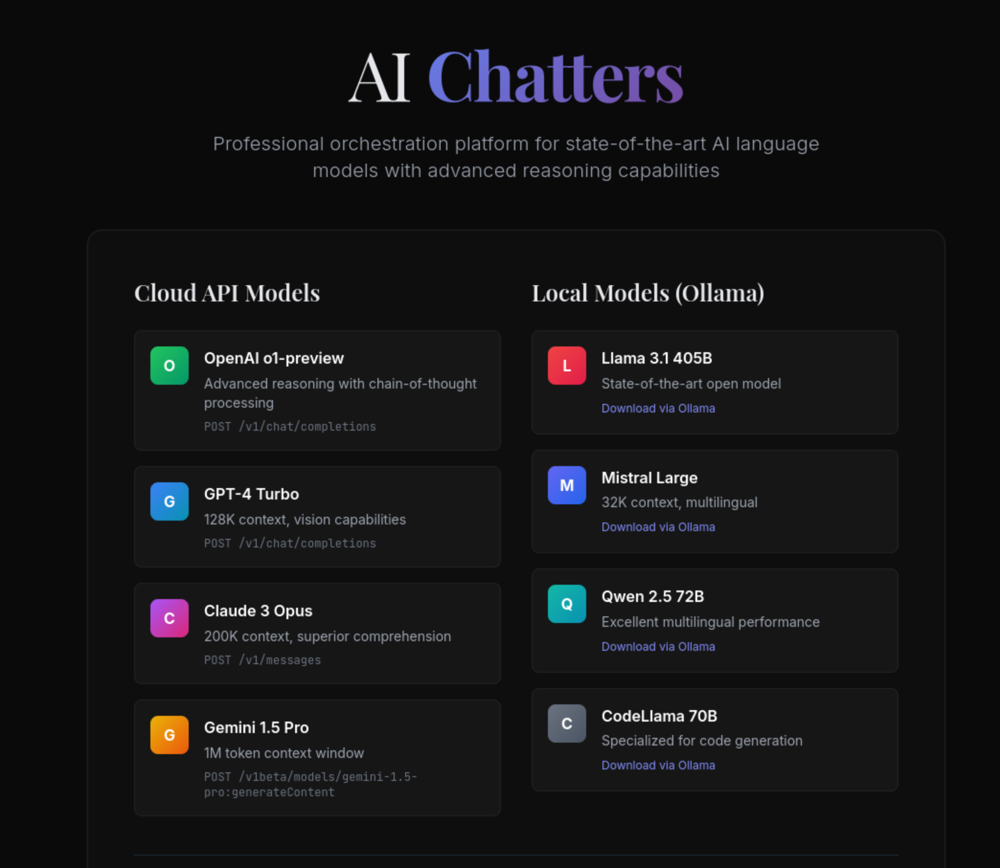

# AI Chatters 🤖

> Professional orchestration platform for state-of-the-art AI language models with advanced reasoning capabilities



## 🌟 Overview

AI Chatters is a powerful web application that enables seamless conversations between multiple AI models from different providers. Create dynamic multi-AI discussions, analyze conversation patterns, and export insights - all through an intuitive interface.

## ✨ Features

### 🎭 **Multi-AI Conversations**
- Orchestrate conversations between multiple AI models simultaneously
- Support for 4 major AI providers:
  - 🤖 **OpenAI** (GPT-4, GPT-3.5, O1-preview)
  - 🎭 **Anthropic** (Claude 3 Opus, Sonnet, Haiku)
  - 🔷 **Google Gemini** (1.5 Pro, Flash, Pro Vision)
  - 🦙 **Ollama** (Local models: Llama, Mistral, Qwen, CodeLlama)

### 📊 **Advanced Analytics**
- **Context Analysis**: Monitor token usage and conversation health
- **Model Performance**: Track participation and response quality
- **Real-time Insights**: Get warnings when context windows are compromised

### 📤 **Export & Documentation**
- **Multiple Formats**: Export conversations as JSON, Markdown, or plain text
- **Automatic Notes**: AI-generated summaries, insights, and action items
- **Conversation History**: Persistent storage with full search capabilities

### 🚀 **Auto-Mode**
- **Autonomous Discussions**: Let AI models chat independently
- **Topic-Driven**: Start conversations with specific topics
- **Turn Management**: Control conversation length and flow

## 🛠️ Technology Stack

- **Backend**: Python Flask with SQLite database
- **Frontend**: HTML5, CSS3 (Tailwind), Vanilla JavaScript
- **AI Integration**: Native APIs for OpenAI, Anthropic, Google, Ollama
- **Features**: RESTful API, session management, multilingual support (DE/EN)

## 🚀 Quick Start

### Prerequisites
- Python 3.8+
- API keys for desired AI providers
- Ollama (optional, for local models)

### Installation

1. **Clone the repository**
```bash
git clone https://github.com/tilltmk/ai-chatters.git
cd ai-chatters
```

2. **Install dependencies**
```bash
pip install flask flask-login werkzeug anthropic openai google-generativeai requests
```

3. **Run the application**
```bash
python app.py
```

4. **Open your browser**
```
http://localhost:5555
```

### Configuration

1. **Register an account** at the welcome page
2. **Navigate to Settings** and add your API keys:
   - OpenAI API Key (from OpenAI Platform)
   - Anthropic API Key (from Anthropic Console)
   - Google AI Key (from AI Studio)
   - Ollama URL (default: localhost:11434)
3. **Test connections** to verify your setup
4. **Create your first conversation**!

## 🎯 Use Cases

### 🔬 **Research & Analysis**
- Compare responses from different AI models
- Analyze reasoning approaches across providers
- Generate comprehensive research summaries

### 💼 **Professional Workflows**
- Brainstorming sessions with multiple AI perspectives
- Code review and technical discussions
- Content creation and editing workflows

### 🎓 **Educational Applications**
- Explore different AI reasoning capabilities
- Learn about model-specific strengths and weaknesses
- Study conversation dynamics and context management

## 📖 API Reference

### Core Endpoints

```bash
# Start a new conversation
POST /api/conversation/new

# Send a message
POST /api/conversation/{id}/message

# Auto-continue conversation
POST /api/conversation/{id}/auto-continue

# Export conversation
GET /api/conversation/{id}/export?format={json|md|txt}

# Analyze context
GET /api/conversation/{id}/analyze-context

# Generate notes
POST /api/conversation/{id}/generate-notes
```

## 🔒 Security & Privacy

- **Local Storage**: All conversations stored locally in SQLite
- **API Key Security**: Keys encrypted and stored securely
- **No Data Sharing**: Your conversations stay on your machine
- **Open Source**: Full transparency with source code available

## 🌍 Multilingual Support

- **German (Deutsch)**: Full interface translation
- **English**: Complete feature set
- **Auto-Detection**: Smart language detection for conversations

## 🤝 Contributing

We welcome contributions! Whether you're fixing bugs, adding features, or improving documentation:

1. Fork the repository
2. Create a feature branch (`git checkout -b feature/amazing-feature`)
3. Commit your changes (`git commit -m 'Add amazing feature'`)
4. Push to the branch (`git push origin feature/amazing-feature`)
5. Open a Pull Request

## 📄 License

This project is licensed under the MIT License - see the [LICENSE](LICENSE) file for details.

## 🙏 Acknowledgments

- Thanks to all AI providers for their powerful APIs
- Built with ❤️ for the AI community
- Special thanks to the open-source community

---

**Ready to start chatting with AI?** [Get your API keys](#configuration) and dive into the future of AI conversations! 🚀